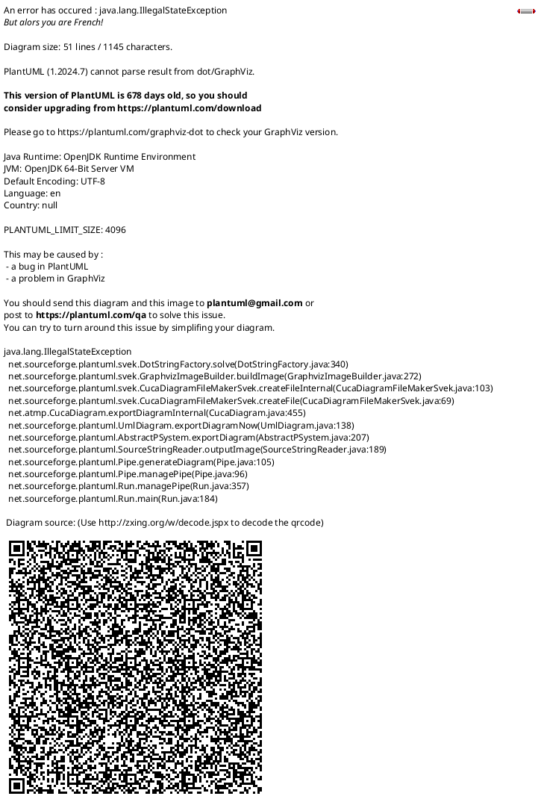

# Trigraph Layer-0 MetaMetaMeta

## Overview

This repository contains the Layer-0 of the trigraph type hierarchy, a self-describing model with multiple meta-levels, type hierarchies, and relation signatures. The system is defined using `.sheet` files.

## Quick Links

- **[Sheet Principles Documentation](SHEET_PRINCIPLES.md)** - Comprehensive documentation of the meta-model principles
- **[Complete Graph Diagram](complete-graph.puml)** - Traditional directed graph visualization (PlantUML)
- **[Complete Graph Grouped](complete-graph-grouped.svg)** - Complete graph with nodes grouped by sheet (SVG)
- **[Trigraph Diagram](trigraph.puml)** - Bipartite hypergraph representation (PlantUML)
- **[MNT Radial Graph](mnt-radial.svg)** - Radial layout centered on metaNType node (SVG)

## Visualizations

### Complete Graph

The [complete-graph.puml](complete-graph.puml) file provides a traditional directed graph visualization of the meta-model:
- **Nodes**: All 32 entities from the `.sheet` files (types, meta-levels, relations, signatures)
- **Edges**: Directed arrows colored by relation type (type, metaLevel, signature, etc.)
- **Shapes**: Different shapes indicate visibility levels
  - Rectangles = public nodes
  - Hexagons = public+1 nodes
  - Circles = private nodes
- **Node coloring**: Relation nodes are colored to match their relation type

### Complete Graph Grouped by Sheet

The [complete-graph-grouped.svg](complete-graph-grouped.svg) provides the same graph structure but with nodes organized into clusters by their source sheet:

- **types.sheet cluster**: class, mt, mlt, mr, mrs, mnt
- **metaLevels.sheet cluster**: ml0, ml1, ml2, ml3, mlN
- **metaRelations.sheet cluster**: type, ml, sig, st, tt, nml (colored nodes)
- **metaRelationSignatures.sheet cluster**: a2at, a2mlt, mnt2mnt, ml2ml, mr2mrs, mrs2mt

This visualization makes it easy to see:
- Which nodes are defined in which sheet
- Cross-sheet dependencies and references
- The modular structure of the meta-model

**Features**:
- Clustered layout groups related nodes
- Shape-coded visibility (box=public, hexagon=public+1, ellipse=private)
- Color-coded edges matching relation types
- Includes legend for shapes and edge colors

### Trigraph

The [trigraph.puml](trigraph.puml) file represents the meta-model as a **bipartite hypergraph**, making the structure more explicit and analyzable.

#### Trigraph Construction

The trigraph transforms directed labeled edges into explicit nodes:

**Original Graph (complete-graph):**
```
a -t-> b
```
where `a` is source node, `t` is relation type, `b` is target node

**Trigraph Representation:**
```
a -red- (r) -green- b
        (r) -blue- t
```
where `(r)` is a black relation node representing the hyperedge

#### Trigraph Structure

1. **White Nodes** (23 nodes): All original nodes from complete-graph
   - Types: class, mt, mlt, mr, mrs, mnt
   - Meta-levels: ml0, ml1, ml2, ml3, mlN
   - Relations: type, ml, sig, st, tt, nml
   - Signatures: a2at, a2mlt, mnt2mnt, ml2ml, mr2mrs, mrs2mt

2. **Black Nodes** (73 nodes): One unlabeled node per relation in complete-graph
   - Each represents a single directed edge from the original graph
   - Explicitly reifies the relations as first-class entities

3. **Three Edge Types** (all undirected):
   - **Red edges**: Connect source node to relation node
   - **Green edges**: Connect relation node to target node
   - **Blue edges**: Connect relation node to relation type

4. **Properties**:
   - **Bipartite**: Every edge connects a white node to a black node
   - **3-uniform**: Every black node has exactly 3 edges (one of each color)
   - **Hypergraph**: Each black node represents a 3-ary hyperedge (source, target, type)

#### Example

The relation `class -type-> metaType` from complete-graph becomes:
```
class -red- (r1)
(r1) -green- metaType
(r1) -blue- type
```

This makes explicit:
- The source of the relation (class)
- The target of the relation (metaType)
- The type of the relation (type)

#### Benefits of Trigraph Representation

1. **Explicit Relations**: Relations become first-class nodes, not just edges
2. **Uniform Structure**: All relations have the same 3-edge pattern
3. **Type Information**: Relation types are explicitly connected
4. **Analyzability**: Easier to query and analyze using graph algorithms
5. **Hypergraph Semantics**: Naturally represents n-ary relations (here, ternary)

### Radial Graph Centered on MetaNType

The [mnt-radial.svg](mnt-radial.svg) provides a radial/concentric visualization of the trigraph centered on the `mnt` (metaNType) node:

**Structure**:
- **Shell 0 (center)**: `mnt` node
- **Shell 1**: 21 black nodes (relations directly connected to mnt)
- **Shell 2**: 17 white nodes (nodes connected to shell 1)
- **Shell 3**: 52 black nodes (relations connected to shell 2)
- **Shell 4**: 5 white nodes (outermost nodes)

**Features**:
- Nodes arranged in equidistant circular shells
- Node ordering optimized to minimize edge crossings
- Color-coded edges (red/green/blue for source/target/type)
- Shows connectivity patterns radiating from central node

This visualization is particularly useful for:
- Understanding the centrality of `metaNType` in the meta-model
- Seeing the distance of other nodes from the core type
- Analyzing the bipartite structure (alternating black/white shells)

## Table of Contents

1. [Core Principles](#core-principles)
2. [Meta-Level Architecture](#meta-level-architecture)
3. [Type System](#type-system)
4. [Visibility Model](#visibility-model)
5. [Relation System](#relation-system)
6. [Sheet File Structure](#sheet-file-structure)
7. [Cross-References](#cross-references)
8. [Diagrams](#diagrams)

---

## Core Principles

### 1. Self-Describing Meta-Model

The system is **self-referential** and **self-describing**. The meta-model uses itself to describe its own structure:
- Types have types
- Relations have types
- Meta-relations describe relations
- The system collapses infinite recursion into a fixed point (metaNType, metaLevel-N)

### 2. Layered Meta-Levels

The architecture implements a **hierarchical meta-level system**:
- **Meta Level 0**: Base data/instance level
- **Meta Level 1**: Types of instances (classes)
- **Meta Level 2**: Meta-types (types of types)
- **Meta Level 3**: Meta-meta-types
- **Meta Level N**: All higher levels collapsed into a single level (N≥4)

### 3. Visibility-Based Modularity

Three visibility levels control access:
- **public**: Visible to all layers
- **public+1**: Visible to the next layer only
- **private**: Not visible outside the current layer

### 4. Type Safety Through Signatures

Relations have **signatures** that constrain:
- Source node types
- Target node types
- Ensuring type safety at the graph level

### 5. Cross-Sheet References

The system is modular with sheets referencing nodes from other sheets using the notation `.sheetName.`.

---

## Meta-Level Architecture

The system implements a fixed-height meta-level tower with a recursive top level.


### Meta-Level Markers

From **metaLevels.sheet**:

| Marker | Description | Visibility |
|--------|-------------|------------|
| `metaLevel-0` | Meta level 0 (instances) | public |
| `metaLevel-1` | Meta level 1 (types) | public |
| `metaLevel-2` | Meta level 2 (meta-types) | public+1 |
| `metaLevel-3` | Meta level 3 (meta-meta-types) | private |
| `metaLevel-N` | Meta levels 4+ collapsed | private |

### Meta-Level Progression


---

## Type System

### Type Hierarchy

The type system has a hierarchical structure where types themselves have types.


### Type Nodes

From **types.sheet**:

| Node | Meta Level | Type | Visibility | Description |
|------|------------|------|------------|-------------|
| `class` | 2 | metaType | public | Type of ML1 nodes (classes) |
| `metaType` | 3 | metaNType | public+1 | Type of ML2 type nodes |
| `metaLevelType` | 3 | metaNType | public+1 | Type of meta level markers |
| `metaRelation` | 3 | metaNType | public | Type of meta relation nodes |
| `metaRelationSignature` | 3 | metaNType | public | Type of signature nodes |
| `metaNType` | N | metaNType | private | Collapsed type for ML≥3 |

---

## Visibility Model

The visibility model controls which nodes are accessible to different layers.


### Visibility Semantics

- **public**: Forms the stable API for all higher layers
- **public+1**: Provides controlled access for the immediate next layer
- **private**: Internal implementation details that can change without breaking external layers

---

## Relation System

### Meta-Relations

From **metaRelations.sheet**:

| Relation | Signature(s) | Visibility | Description |
|----------|--------------|------------|-------------|
| `type` | any-to-anyType | public | Links node to its type |
| `metaLevel` | any-to-metaLevelType | public | Specifies meta level |
| `signature` | metaNType-to-metaNType, metaRelation-to-metaRelationSignature | public | Specifies relation signature |
| `sourceType` | metaNType-to-metaNType, metaRelationSignature-to-metaType | public+1 | Type constraint on source |
| `targetType` | metaNType-to-metaNType, metaRelationSignature-to-metaType | public+1 | Type constraint on target |
| `nextMetaLevel` | metaLevelType-to-metaLevelType | private | Links consecutive meta levels |

### Relation Signatures

Signatures define type constraints for relations. A relation can have multiple signatures at different abstraction levels.


### Signature Types

From **metaRelationSignatures.sheet**:

| Signature | Source Constraint | Target Constraint | Description |
|-----------|-------------------|-------------------|-------------|
| `any-to-anyType` | none | class, metaType, metaNType, metaLevelType | Target must be a type node |
| `any-to-metaLevelType` | none | metaLevelType | Target must be meta level marker |
| `metaNType-to-metaNType` | metaNType | metaNType | Both must be high-level meta types |
| `metaRelation-to-metaRelationSignature` | metaRelation | metaRelationSignature | Meta relation to its signature |
| `metaLevelType-to-metaLevelType` | metaLevelType | metaLevelType | Between meta level markers |
| `metaRelationSignature-to-metaType` | metaRelationSignature | metaType | Signature to meta type |

---

## Sheet File Structure

Each `.sheet` file follows a consistent structure:

```yaml
meta:
  name: <sheet-name>
  package: <package-name>
  description: <description>

references:
  <node-name>: .<sheet-name>.
  ...

public:
  <node-name>: <description>
  ...

public+1:
  <node-name>: <description>
  ...

private:
  <node-name>: <description>
  ...

relations:
  <source> -<relation>-> <target>
  ...
```

### Sheet Structure Components


### Section Purposes

1. **meta**: Metadata about the sheet itself
2. **references**: External nodes from other sheets
3. **public/public+1/private**: Node definitions with visibility control
4. **relations**: Graph edges between nodes

---

## Cross-References

Sheets form a dependency graph through cross-references.


### Dependency Patterns

1. **Circular Dependencies**: The sheets have circular references, which is intentional and necessary for the self-describing nature
2. **types.sheet**: Central hub referenced by all others
3. **metaRelations.sheet**: Defines the relation vocabulary
4. **metaLevels.sheet**: Provides level markers
5. **metaRelationSignatures.sheet**: Depends on all others for type constraints

---

## Diagrams

### Complete Meta-Model Overview



### Type Instantiation Chain Example


### Signature Constraint Example


---

## Key Insights

### 1. Fixed-Point Recursion

The system prevents infinite meta-level regress by introducing a fixed point at meta-level N:
- `metaNType -type-> metaNType`
- `metaLevel-N -nextMetaLevel-> metaLevel-N`

This creates a stable foundation for the self-describing meta-model.

### 2. Dual Signatures

Some relations have multiple signatures at different abstraction levels:
- **Generic signature** (e.g., `metaNType-to-metaNType`): Describes the relation at the meta level
- **Specific signature** (e.g., `metaRelation-to-metaRelationSignature`): Describes the relation with concrete types

This allows the system to maintain type safety at multiple levels of abstraction.

### 3. Visibility as Architecture

The three-level visibility model (public, public+1, private) creates:
- **Stable APIs**: public nodes form the contract
- **Controlled evolution**: public+1 allows gradual changes
- **Implementation hiding**: private nodes can be refactored freely

### 4. Meta-Circularity

The system is meta-circular:
- Relations have types (metaRelation)
- Types have types (class -type-> metaType)
- Meta-levels are typed (metaLevelType)
- Signatures are typed (metaRelationSignature)

This self-description enables powerful introspection and validation capabilities.

### 5. Modular Self-Description

By splitting the meta-model across four sheets:
- **types.sheet**: The ontology
- **metaLevels.sheet**: The stratification
- **metaRelations.sheet**: The vocabulary
- **metaRelationSignatures.sheet**: The constraints

The system achieves separation of concerns while maintaining coherence through cross-references.

---

## Summary

The `.sheet` file system implements a sophisticated meta-modeling framework with:

1. **Stratified meta-levels** (0, 1, 2, 3, N) with fixed-point recursion
2. **Self-describing type system** where types have types
3. **Visibility-controlled modularity** (public, public+1, private)
4. **Type-safe relations** through signature constraints
5. **Cross-sheet references** enabling modular composition
6. **Meta-circular architecture** where the system describes itself

This architecture provides a foundation for building layered, type-safe graph systems with introspection capabilities and controlled evolution.
